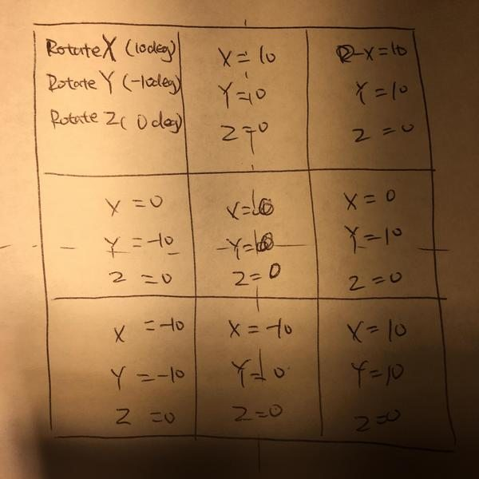

# Chenfeng Lai’s Writeup

> A summary of my experiences with Team 12 of the MD Hackathon on Feb 24-26 2017.

Thanks [@cbracco](http:/github.com/cbracco) for great project management.

## Tilt Hover without JS

In this Hackathon I decided to pick some elements which I have not idea about how to build it. I picked Tilt Hover and rebuilt it by only using CSS3 and HTML.

My [solution](https://cbracco.github.io/md-hackathon-team12/assets/ui/tilt/tilt.html) is simple, I built a 3 * 3 grid layer on the bottom, then I added a picture layer, a frame layer and a text layer above the grid layer. When a grid is hovered, the above layers will be transformed according.

Example - Change RotateX and RotateY for the picture layer.

## Takeaways:

I really enjoy this Hackathon and It was my great pleasure to work with my team. Here are my takeaways:

- I learned how to use Trello to enable an online Kanban broad for a project. (Thanks for [@cbracco](http:/github.com/cbracco))
- I also improved my understanding about css3 transform rotate and translate.
- Chrome developer tool helped my to inspect the example, so I could understand DOM changes.
- Work closely with your team to help each others.
- Understand how to do it in high level is easy. Completely delivery a working product is not that easy :smile:
