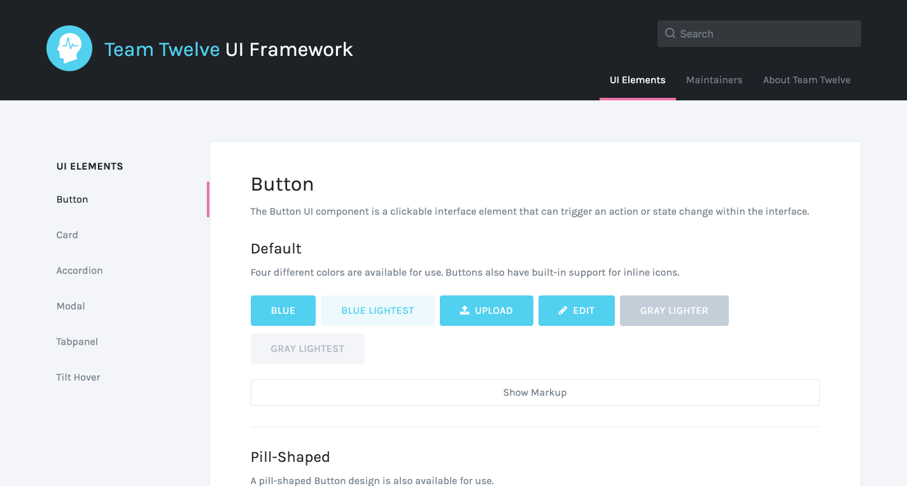

# Chris Bracco’s Writeup

> A summary of my experiences with Team 12 of the MD Hackathon on Feb 24-26 2017.

Before the hackathon started, our team members were shuffled around a few times. The student who first volunteered to be the Team 12 project manager was assigned to another team shortly after creating a Trello board and Slack channel. After that student left our team, I volunteered to take on the project manager role and began by creating a new Trello board, Slack channel, and GitHub repository for Team 12.

On Friday evening, Team 12 met in our Slack channel to introduce ourselves and make some important preliminary decisions. I led the conversation and made suggestions on how we should organize our project. I walked my teammates through the process of cloning our GitHub repository to their local machines, and syncing the `gh-pages` branch with the `master` branch so that every time we push new code to `master` it automatically updates the website, too. For the team members who arrived later in the evening, I helped them get up to speed with what we had accomplished up to that point.

We used the Trello board to break up the project into smaller tasks, and assigned each task to a member so that all of the responsibilities were covered.

I broke up the Trello board into several lists: **Resources**, **Backlog**, **Next Up**, **Doing**, and **Done**. This way we had one place to go for all of the information we needed for the hackathon, and we could keep track of our progress throughout the weekend. I also created labels to use for each card, so we could categorize tasks.

Once we were organized and the work was split up, each team member began working on their respective tasks.

- **Chris Bracco (Project Manager, Developer):** Showcase website, Refinement of UI components
- **Chenfeng Lai (Product Manager, Developer):** Tilt Hover Effects
- **Jason Rivera (Developer):** Card UI Component
- **Jennifer Chiang (Developer):** Button UI Component, Modal UI Component
- **Leonardo De Leon (Developer):** Tabpanel UI Component
- **Chris Feltus (Developer):** Accordion UI Component

I volunteered to build the showcase website, and got to work immediately on the website frame and layout design so that when the time came I could easily drop in the UI components that everyone else was working on.

Despite the fact that the provided designs focus on larger screen sizes, I used a “mobile-first” responsive design approach to build the website. The sidebar navigation begins as an off-canvas menu using the CSS checkbox hack to toggle its visibility. As the screen gets larger, the sidebar navigation becomes visible and sticks to the viewport as the user scrolls. It also uses a barebones “scrollspy” functionality, written in JS, to indicate which section the user is viewing as they scroll up and down the page.

As each team member finished their UI components, I refactored them to so they would look closer to the original designs, and I made sure that they were encapsulated using structured class names so they could be safely inserted into the website without breaking the pge layout.

All in all, we had a very smooth and productive work experience together! I was very impressed with the quality of work from each student, and the speed at which we all completed our tasks. The overlap in team memerb availability and the constant open communication helped drive Team 12 to a successful end result!

[View the finished product!](https://cbracco.github.io/md-hackathon-team12/)
